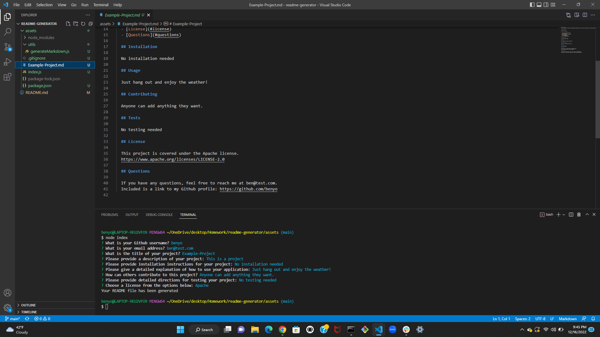
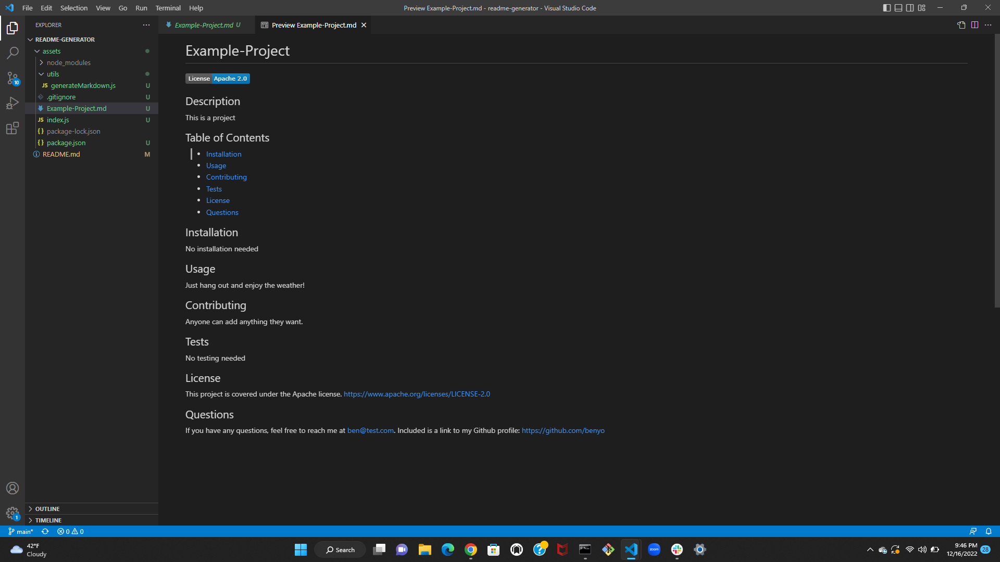

# README Generator

  ## Description
  
  This application creates a README file based on user input. The user is presented with a series of questions, and the application inputs that data into a template and prints it. This application is meant to make writing README's easier for busy developers and bootcamp students.
  
  ## Table of Contents
  
  - [Installation](#installation)
  - [Usage](#usage)
  - [Contributing](#contributing)
  - [Tests](#tests)
  - [License](#license)
  - [Questions](#questions)
  
  ## Installation
  
  Inquirer is required to run this application. To install inquirer, download the application files and open the assets folder in terminal. In the terminal type npm i to install Inquirer. After installing Inquirer, the user can simply run the application by inputting the command "node index" in the terminal.
  
  ## Usage
  
  To use this application, simply answer the questions presented in the terminal when you run the program, and your README file will automatically generate in the assets folder. Your README will have a custom filename and title, as well as custom installation, description, usage, and contribution sections. The program will also allow the user to choose a license, and the license badge will appear on the README, as well as a customized License section with a link to the license.

  
  
  
  ## Contributing
  
  Others can contribute to this project by adding new features to the program, such as the option to generate other kinds of files.
  
  ## Tests
  
  N/A

  ## License
  No license.
  
  ## Questions
  
  If you have any questions, feel free to reach me at benyomtov@comcast.net. 
  Included is a link to my Github profile: https://github.com/benyomtov
